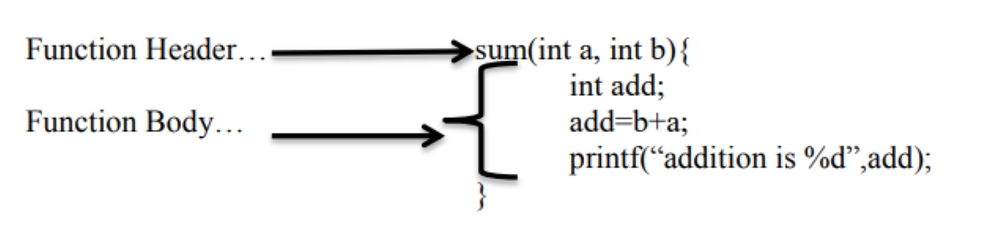
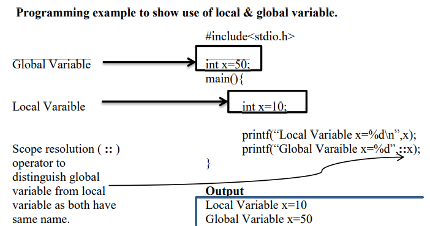
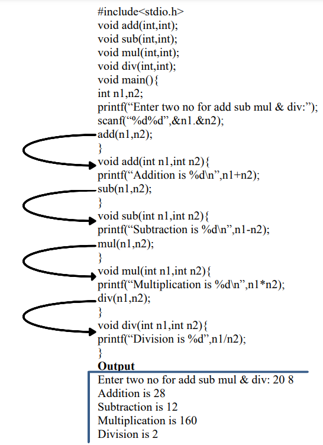
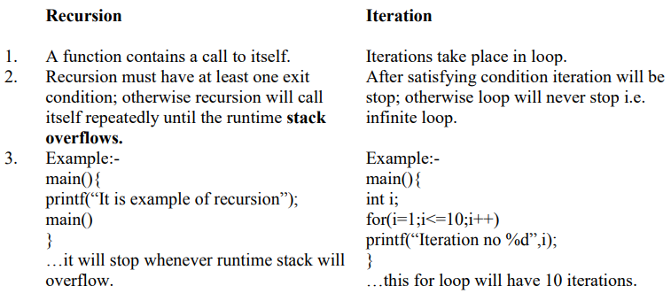

  
  <h1 align="center">C Programming Language</h1>
  <h3>Notes by:  Prof. Dhananjay Joshi </h3>

## Functions
 - A function is a subprogram which performs a well-defined task.
 - Every C program is a collection of functions.
 - There should be at least one function called main( ).
 - Every program execution starts with main( ) & main( ) is only one user define function known
by Operating System.
 - C supports two types of functions
    1. Built-in Library Functions
    2. User Define Functions
        1. Built-in Library Functions:-
         These functions are provided by C.
         Examples are, printf(), scanf(), pow(), sqrt(), strlen(), puts(),clrscr() etc.
        2. User define functions:-
 Programmer can define their own functions.
## Advantages of functions:-
- Program maintenance & debugging is easy.
- Reusability of code.
- Reduces program development time.
- Work distribution is possible.
- Easy to understand & easy to write.
- Reduces coding size.
## User Define Functions:-
User can define their own functions.
- Basic Parts/Components/Elements of functions:-
  1. Function Prototype Or Function Declaration.
  2. Function Calling.
  3. Function Definition.
1. Function Prototype or Declaration.
  - Like variables functions are also declared called function prototype.
  - Function should be declared before they are used.
  - We can declare function inside main() or above the main().
  - Function declaration or prototype is used to tell compiler about following:
      1. Return type of function.
      2. Number of parameters or arguments.
      3. Type of parameters.
      4. Name of the function.
- Syntax:-
 return_type (datatype arg1, datatype arg2, ……..datatype argn);
- Example:-
    1. int sum(int a, int b );
    2. int sum(int, int );
2. Function Calling.
    - Function is called when a function name is followed by a semi comma.
    - Whenever function is called, actual parameters of calling functions are copied into formal parameters of called function(if any).
    - Number of actual and formal parameters should be same(if any).
    - Name of actual and formal parameters may be same or different(if any).
    - We can call functions using(also called Parameter Passing)
       1. Call by Value.
       2. Call by reference.
- Syntax:-
 function_name(parameter_list);
    - Whenever function is called return type is not required.
- Example:-
    1. add(a,b);
    2. add(&a, &b);
3. Function Definition.
    - User define functions definition consists of following two parts.
      1. Function Header.
          - It contains „return type‟, „function name‟ & „argument list‟
          - Function header is not terminated by a semi colon.
      2. Function Body
          - Function body should be enclosed in curly braces „{„ & „}‟.
          - It contains executable statements along with return value, if any.
          - These executable statements performs well define task.
- Syntax:-
 return_type function_name ( argument_list){
 //function body.
 }
- Example:-
      
## Call by Value
- Whenever parameters/arguments are passed by value, the actual parameter in calling function are
copied into corresponding formal parameters of called function.
- With call by value, changes made to formal parameters of called function have no effect on the
values of actual parameters in calling function.
- Multiple values cannot be return…
## Call by Reference or Call by Address:-
- Whenever the parameters/arguments are passed by reference the address of actual parameter in
calling function are copied into formal parameter of called function.
- In call by reference, changes made to the formal parameter in called function have effect on the
values of actual parameter in the calling function.
- Function can return more than one value at a time.(even function may not have return type.)
## Local & Global Variables:-
1. Local Variable:-
  - A variable declared within function body is called as local variable.
  - Local variables are referenced by the statements that are inside the body of function in
which the variables are declared.
  - Local variables get activated upon entry of control to the block/body & deactivated or
destroyed upon exit.
  - We can give same name to local variables in different functions or block.
2. Global Variable:-
  - A variable which is declared outside of all functions is called a global variable.
  - Global variables are referenced by any functions available in program.
  - Global variable may however be placed anywhere in the program, prior to their first use,
provided they are defined outside(above) the function, in this case the content of
variables are available for use only by those functions of the program occurring after their
declaration.
  - If in any program local variable & global variable name is same then scope resolution (::)
operator is used to distinguish global variable from local variable
  

## Nesting of Functions:
- In c we can also have nesting of functions means one function can call second function & second
function can call third function and so on.
- Programming Example to show use of Nesting of Functions…
  
## Recursive Function or Recursion:
- Recursive function or recursion is a function which contains a call to itself.
- Works similar to Divide and conquer.
- Recursion must contains one exit condition that can be satisfied, otherwise the recursive function
will call itself repeatedly until the runtime stack overflows.
- Recursion is of two types:-
    1. Direct Recursion
   Calling same function within same function recursively.
    2. Indirect Recursion
   Calling second function from first function and second and second function have call to
first function, it is indirect recursion.
- Differentiate between
  
