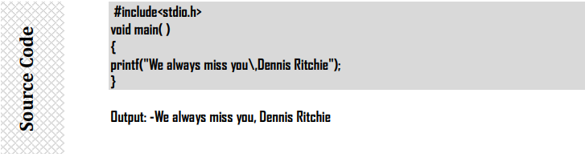

  
  <h1 align="center">C Programming Language</h1>
  <h3>Notes by: Dhananjay Joshi Sir. </h3>

## About Programming Languages:
  - Programming Languages are the languages design to express computation that can be performed by a machine (computer).
  - Programming Languages are used to create programs that control the behavior of machine to express algorithm or mode of human communications with computer.

## About of C:
  - It is structural and/or procedural language.
  - It is an problem solving language.
  - It is an artificial language used to communicate with computer by Implementing code/programs.

## Features of C:
  1. Simple & portable, can run on any hardware platform.
  2. Faster execution, reliable, effective, flexible and small(32 key words).
  3. Rich set of operators and library functions.
  4. Supports systems programming & Ability to extend itself.
  5. It is programmer’s language, as we use C for System Programming.

## Applications of C
  1. To design computer games.
  2. In business application
  3. In embedded system.
  4. In networking.
  5. In database (File).
  6. To develop system software.

## Uses of C
Following System Software’s (Programs) are written in C:
  1. Operating Systems – Examples => Unix & Linux
  2. Assembler, Compiler and interpreters.
       a. Java Language Compiler is written in C/C++.
       b. Oracle and its interpreter is written in C.
  3. Network drivers.
  4. Print spoolers.
  5. Modem programs.

## Source Code or Source Program
  - Program: - Program is a set of instructions or statements that are grouped together to accomplish as
  task or tasks.
  - Source Code is nothing but program text that we write.
  - A source code of C language is based on building blocks. The building blocks are called functions.
  - A C program (Source Code) is a collection of one or more functions.
  
  
## Algorithms
- Algorithm is a sequence of steps used to complete the task . or
- Algorithm is just a detailed sequence of simple steps that are needed to solve a problem
Algorithm must satisfy following criteria or following properties or characteristics of algorithm
  a.   It must be finite (algorithm must terminate)
  b.   It must be unambiguous ( Definiteness)
  c.   It must be executable (Non- intuitiveness)
  d.   It must have 0 or more input (input)
  e.   It must have 1 or more output (output)
  f.   It should be general so that it can solve any problem of a particular type for which it is
constructed (completeness/ generally )
  g.   For every input instance it halts with correct output (correct)
Conventions used in writing Algorithm:
1. Name of algorithm:
  - Every algorithm is given a name which reflects the task performed by it.
2. Introductory comments:
  - The task performed by algorithm is described briefly any assumption made by algorithm are
mentioned along with variable used and data types
3. Steps :
  - Any algorithm is made up of sequence of numbered steps. Each step is proceeded by a brief
comment describing its function
4. Comments are included within the body of step by enclosing them in parentheses.

